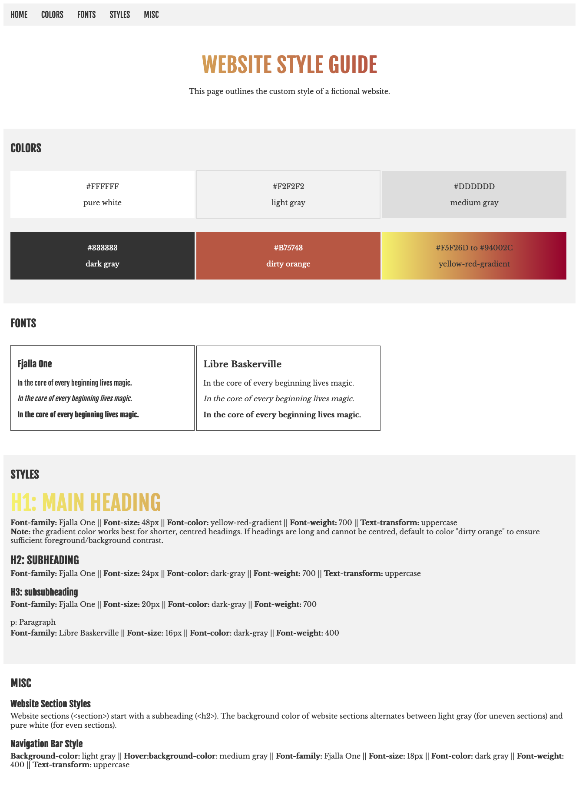

# Build a Website Design System

CodeCademy project, done on my computer. 

## Description

The project's task was to create a website design system and document the building blocks of the website in terms of colors, fonts, and repeating styles. 

## Screenshot

This is how my solution to the project looks like:

## Built with

* Visual Studio Code
* HTML
* CSS
* Markdown
* Adobe Color
* Google Fonts

## Run
Download the respository and open index.html in a browser. 